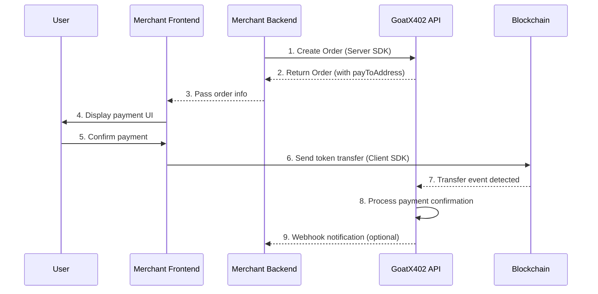
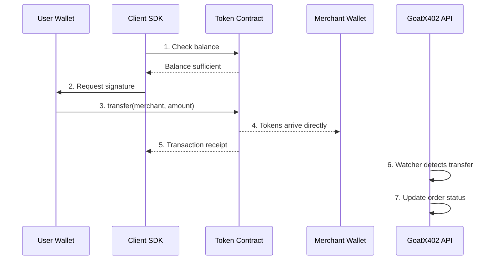
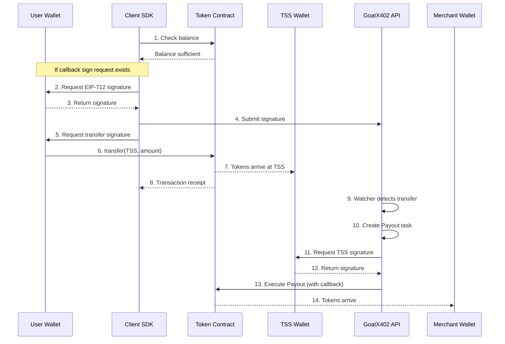

# GoatX402 SDK Integration Guide

## Table of Contents

1. [Overview](#1-overview)
2. [Quick Start (10 minutes)](#2-quick-start-10-minutes)
3. [Architecture & System Structure](#3-architecture--system-structure)
4. [Two Payment Modes Explained](#4-two-payment-modes-explained)
5. [Fee Model](#5-fee-model)
6. [Backend Integration (Server SDK)](#6-backend-integration-server-sdk)
7. [Frontend Integration (Client SDK)](#7-frontend-integration-client-sdk)
8. [Security & Authentication Model](#8-security--authentication-model)
9. [API Reference](#9-api-reference)
10. [Error Handling & Troubleshooting](#10-error-handling--troubleshooting)
11. [Versioning & Compatibility](#11-versioning--compatibility)
12. [Best Practices](#12-best-practices)
13. [Appendix](#13-appendix)
14. [Gaps & TODOs](#14-gaps--todos)

---

## 1. Overview

### 1.1 What is GoatX402

GoatX402 is a comprehensive cryptocurrency payment processing platform supporting EVM chains and Solana. It provides two payment receiving modes to meet different merchant needs.

### 1.2 SDK Components

| SDK | Purpose | Package |
|-----|---------|---------|
| **goatx402-sdk** | Frontend client SDK | `npm install goatx402-sdk` |
| **goatx402-sdk-server-ts** | TypeScript backend SDK | `npm install goatx402-sdk-server` |
| **goatx402-sdk-server-go** | Go backend SDK | `go get github.com/goatx402/sdk-server-go` |

### 1.3 Two Payment Modes

| Mode | Identifier | Receiving Method | Fixed Fee | Use Case |
|------|------------|------------------|-----------|----------|
| **Direct Mode** | `DIRECT` | User transfers directly to merchant wallet | Lower (e.g., $0.10/tx) | Simple payments, no callbacks |
| **Delegate Mode** | `DELEGATE` | User transfers to TSS wallet, system pays merchant | Higher (e.g., $0.20/tx) | Callbacks, complex business logic |

### 1.4 Supported Blockchain Networks

| Network | Chain ID | Support Status |
|---------|----------|----------------|
| Ethereum | 1 | ✅ |
| Polygon | 137 | ✅ |
| Arbitrum | 42161 | ✅ |
| BSC | 56 | ✅ |
| Solana | - | ✅ |
| GOAT Testnet | 2345 | ✅ Test |

---

## 2. Quick Start (10 minutes)

### 2.1 Prerequisites

1. **Merchant Account**: Contact GoatX402 to obtain
2. **API Credentials**: `API_KEY` and `API_SECRET`
3. **Fee Balance**: Ensure sufficient USD fee balance

### 2.2 Installation

```bash
# Backend SDK
npm install goatx402-sdk-server

# Frontend SDK
npm install goatx402-sdk ethers
```

### 2.3 Backend: Create Order

```typescript
import { GoatX402Client } from 'goatx402-sdk-server'

// Initialize client
const client = new GoatX402Client({
  baseUrl: 'https://api.goatx402.com',
  apiKey: process.env.GOATX402_API_KEY,
  apiSecret: process.env.GOATX402_API_SECRET,
})

// Create payment order
async function createOrder(userId: string, amount: string) {
  const order = await client.createOrder({
    dappOrderId: `order_${Date.now()}`,  // Merchant order ID
    chainId: 137,                         // Polygon
    tokenSymbol: 'USDC',
    tokenContract: '0x3c499c542cef5e3811e1192ce70d8cc03d5c3359',
    fromAddress: '0xUserWalletAddress',   // User wallet address
    amountWei: '10000000',                // 10 USDC (6 decimals)
    // callbackCalldata: '0x...',         // Optional: callback data (delegate mode only)
  })

  return order
}
```

### 2.4 Frontend: Execute Payment

```typescript
import { PaymentHelper } from 'goatx402-sdk'
import { ethers } from 'ethers'

async function executePayment(order: Order) {
  // Connect wallet
  const provider = new ethers.BrowserProvider(window.ethereum)
  const signer = await provider.getSigner()
  const payment = new PaymentHelper(signer)

  // If callback sign request exists (delegate mode), sign first
  if (order.calldataSignRequest) {
    const signature = await payment.signCalldata(order)
    await submitSignatureToBackend(order.orderId, signature)
  }

  // Execute payment
  const result = await payment.pay(order)

  if (result.success) {
    console.log('Payment successful:', result.txHash)
  }
}
```

### 2.5 Verify Integration

```typescript
// Query order status
const status = await client.getOrderStatus(orderId)

// Order status flow
// CHECKOUT_VERIFIED → PAYMENT_CONFIRMED → INVOICED
```

---

## 3. Architecture & System Structure

### 3.1 System Architecture

```
┌─────────────────────────────────────────────────────────────────┐
│                      Merchant System                             │
│  ┌──────────────────┐        ┌──────────────────┐              │
│  │  Merchant Backend │        │ Merchant Frontend │              │
│  │  (Server SDK)     │        │  (Client SDK)     │              │
│  └────────┬─────────┘        └────────┬─────────┘              │
└───────────┼────────────────────────────┼────────────────────────┘
            │                            │
            │ HMAC Signature Auth        │ Wallet Interaction
            ▼                            ▼
┌───────────────────────────────────────────────────────────────────┐
│                      GoatX402 Platform                             │
│  ┌─────────────┐  ┌─────────────┐  ┌─────────────┐              │
│  │  API Gateway │  │ Payment Eng │  │ TSS Gateway │              │
│  └─────────────┘  └─────────────┘  └─────────────┘              │
│                                                                  │
│  ┌─────────────┐  ┌─────────────┐  ┌─────────────┐              │
│  │ EVM Watcher │  │ Sol Watcher │  │ Fee System  │              │
│  └─────────────┘  └─────────────┘  └─────────────┘              │
└───────────────────────────────────────────────────────────────────┘
            │                            │
            ▼                            ▼
┌───────────────────────────────────────────────────────────────────┐
│                      Blockchain Networks                          │
│  ┌──────────┐  ┌──────────┐  ┌──────────┐  ┌──────────┐        │
│  │ Ethereum │  │ Polygon  │  │   BSC    │  │  Solana  │        │
│  └──────────┘  └──────────┘  └──────────┘  └──────────┘        │
└───────────────────────────────────────────────────────────────────┘
```

### 3.2 Data Flow Overview



---

## 4. Two Payment Modes Explained

### 4.1 Direct Mode (DIRECT)

**Overview**: User directly transfers tokens to merchant's wallet address, without GoatX402 intermediation.

**Features**:
- Simplest payment method
- Lowest fixed fee
- No TSS wallet involvement
- No callback support

**Payment Flow**:



**Flow Types**: `ERC20_DIRECT`, `SOL_DIRECT`

**Code Example**:

```typescript
// Backend creates order
const order = await client.createOrder({
  dappOrderId: 'order_001',
  chainId: 137,
  tokenSymbol: 'USDC',
  tokenContract: '0x3c499c542cef5e3811e1192ce70d8cc03d5c3359',
  fromAddress: userWallet,
  amountWei: '10000000',
  // No callbackCalldata - Direct mode
})

// order.flow = 'ERC20_DIRECT'
// order.payToAddress = Merchant wallet address
```

---

### 4.2 Delegate Mode (DELEGATE)

**Overview**: User transfers tokens to GoatX402's TSS wallet, GoatX402 then transfers funds to merchant.

**Features**:
- Supports callback functionality (execute merchant contracts)
- Higher fixed fee (includes TSS payout gas cost)
- TSS multi-sig wallet ensures fund security
- Supports complex business logic

**Payment Flow**:



**Flow Types**: `ERC20_3009`, `ERC20_APPROVE_XFER`, `SOL_APPROVE_XFER`

**Code Example**:

```typescript
// Backend creates order (with callback)
const order = await client.createOrder({
  dappOrderId: 'order_002',
  chainId: 137,
  tokenSymbol: 'USDC',
  tokenContract: '0x3c499c542cef5e3811e1192ce70d8cc03d5c3359',
  fromAddress: userWallet,
  amountWei: '10000000',
  callbackCalldata: '0x...', // Callback data (optional)
})

// order.flow = 'ERC20_3009' or 'ERC20_APPROVE_XFER'
// order.payToAddress = TSS wallet address
// order.calldataSignRequest = EIP-712 sign request (if callback exists)
```

---

### 4.3 Mode Comparison

| Feature | Direct Mode (DIRECT) | Delegate Mode (DELEGATE) |
|---------|----------------------|--------------------------|
| **Receiving Address** | Merchant wallet | TSS wallet |
| **Fixed Fee** | Lower (e.g., $0.10) | Higher (e.g., $0.20) |
| **Funds Arrival** | Immediate after user transfer | After TSS Payout |
| **Callback Support** | ❌ Not supported | ✅ Supported |
| **Use Case** | Simple payments | Complex business logic |
| **Gas Cost** | User only | User + TSS both need Gas |

---

## 5. Fee Model

### 5.1 Fee Structure

GoatX402 uses a **fixed fee** model (not percentage), charged per order.

| Fee Type | Direct Mode | Delegate Mode | Description |
|----------|-------------|---------------|-------------|
| Order Fee | `fee_usd_direct` | `fee_usd_delegate` | Fixed USD fee configured per chain |
| Default Fee | $0.10/tx | $0.20/tx | Customizable per chain |

**Why is Delegate Mode fee higher?**
- TSS needs to execute Payout transaction
- Additional on-chain gas cost
- Multi-signature security mechanism cost

### 5.2 Fee Balance System

Merchants need to **pre-fund a USD fee balance**, deducted when orders are created.

```
┌─────────────────────────────────────────────────────┐
│                Fee Balance Flow                      │
├─────────────────────────────────────────────────────┤
│                                                     │
│  1. Operator topup → merchant_fee_balance += $100   │
│                                                     │
│  2. Create order → Check balance                    │
│     ├─ Insufficient → Return HTTP 402 error         │
│     └─ Sufficient → Charge fee, create order        │
│                                                     │
│  3. Payment successful → Fee consumed (no refund)   │
│                                                     │
│  4. Order expired → Fee refunded → balance += fee   │
│                                                     │
└─────────────────────────────────────────────────────┘
```

### 5.3 Fee Calculation Examples

```typescript
// Direct mode order
const directOrder = {
  chainId: 137,  // Polygon
  mode: 'DIRECT',
  fee: '$0.10',  // Fixed fee
}

// Delegate mode order
const delegateOrder = {
  chainId: 137,  // Polygon
  mode: 'DELEGATE',
  fee: '$0.20',  // Fixed fee (includes Payout Gas)
}

// Whether order amount is $10 or $10,000, fee is fixed
```

### 5.4 Insufficient Balance Handling

```typescript
try {
  const order = await client.createOrder(orderParams)
} catch (error) {
  if (error.status === 402) {
    // Fee balance insufficient
    console.error('Insufficient fee balance, please contact operator to topup')
    // error.message: "Insufficient fee balance"
  }
}
```

---

## 6. Backend Integration (Server SDK)

### 6.1 Initialization

```typescript
import { GoatX402Client } from 'goatx402-sdk-server'

const client = new GoatX402Client({
  baseUrl: process.env.GOATX402_API_URL,    // API URL
  apiKey: process.env.GOATX402_API_KEY,      // API Key
  apiSecret: process.env.GOATX402_API_SECRET, // API Secret
})
```

### 6.2 Create Order

```typescript
interface CreateOrderParams {
  dappOrderId: string       // Merchant order ID (unique)
  chainId: number           // Chain ID
  tokenSymbol: string       // Token symbol
  tokenContract: string     // Token contract address
  fromAddress: string       // Payer address
  amountWei: string         // Amount (smallest unit)
  callbackCalldata?: string // Callback data (delegate mode optional)
}

const order = await client.createOrder({
  dappOrderId: `order_${Date.now()}`,
  chainId: 137,
  tokenSymbol: 'USDC',
  tokenContract: '0x3c499c542cef5e3811e1192ce70d8cc03d5c3359',
  fromAddress: '0x742d35Cc6634C0532925a3b844Bc...',
  amountWei: '10000000', // 10 USDC
})
```

### 6.3 Order Response

```typescript
interface OrderResponse {
  orderId: string                  // GoatX402 order ID
  flow: PaymentFlow                // Payment flow type
  payToAddress: string             // Receiving address
  expiresAt: number                // Expiration time (Unix timestamp)
  calldataSignRequest?: {          // EIP-712 sign request (if callback exists)
    domain: EIP712Domain
    types: Record<string, EIP712Type[]>
    primaryType: string
    message: SignMessage
  }
}
```

### 6.4 Query Order Status

```typescript
const status = await client.getOrderStatus(orderId)

// status.status possible values:
// - 'CHECKOUT_VERIFIED'  : Awaiting payment
// - 'PAYMENT_CONFIRMED'  : Payment confirmed
// - 'INVOICED'           : Complete (invoiced)
// - 'EXPIRED'            : Expired
// - 'FAILED'             : Failed
```

### 6.5 Submit Callback Signature

```typescript
// After user signs on frontend, submit to backend
await client.submitCalldataSignature(orderId, {
  signature: '0x...',  // User's EIP-712 signature
})
```

### 6.6 Get Payment Proof

```typescript
// Get proof after payment completion
const proof = await client.getPaymentProof(orderId)

// proof contains on-chain tx hash and GoatX402 signature proof
```

---

## 7. Frontend Integration (Client SDK)

### 7.1 Installation & Initialization

```typescript
import { PaymentHelper, ERC20Token, parseUnits, formatUnits } from 'goatx402-sdk'
import { ethers } from 'ethers'

// Connect wallet
const provider = new ethers.BrowserProvider(window.ethereum)
await provider.send('eth_requestAccounts', [])
const signer = await provider.getSigner()

// Create PaymentHelper
const payment = new PaymentHelper(signer)
```

### 7.2 Complete Payment Flow

```typescript
async function processPayment(order: Order) {
  const provider = new ethers.BrowserProvider(window.ethereum)
  const signer = await provider.getSigner()
  const payment = new PaymentHelper(signer)

  // 1. Verify network
  const network = await provider.getNetwork()
  if (Number(network.chainId) !== order.chainId) {
    await provider.send('wallet_switchEthereumChain', [
      { chainId: `0x${order.chainId.toString(16)}` },
    ])
  }

  // 2. Check balance
  const balance = await payment.getTokenBalance(order.tokenContract)
  const required = BigInt(order.amountWei)
  if (balance < required) {
    throw new Error('Insufficient balance')
  }

  // 3. If callback sign request exists (delegate mode), sign first
  if (order.calldataSignRequest) {
    const signature = await payment.signCalldata(order)
    // Submit signature to backend
    await fetch('/api/orders/sign', {
      method: 'POST',
      headers: { 'Content-Type': 'application/json' },
      body: JSON.stringify({ orderId: order.orderId, signature }),
    })
  }

  // 4. Execute payment
  const result = await payment.pay(order)

  if (result.success) {
    console.log('Transaction hash:', result.txHash)
    // Notify backend payment initiated
    await fetch('/api/orders/notify', {
      method: 'POST',
      body: JSON.stringify({ orderId: order.orderId, txHash: result.txHash }),
    })
  }

  return result
}
```

### 7.3 React Hook Example

```typescript
// hooks/useGoatX402Payment.ts
import { useState, useCallback } from 'react'
import { PaymentHelper, Order, PaymentResult } from 'goatx402-sdk'
import { ethers } from 'ethers'

export function useGoatX402Payment() {
  const [loading, setLoading] = useState(false)
  const [error, setError] = useState<string | null>(null)

  const pay = useCallback(async (order: Order): Promise<PaymentResult | null> => {
    setLoading(true)
    setError(null)

    try {
      const provider = new ethers.BrowserProvider(window.ethereum)
      const signer = await provider.getSigner()
      const payment = new PaymentHelper(signer)

      // Handle callback signature
      if (order.calldataSignRequest) {
        const sig = await payment.signCalldata(order)
        await submitSignature(order.orderId, sig)
      }

      const result = await payment.pay(order)

      if (!result.success) {
        setError(result.error || 'Payment failed')
      }

      return result
    } catch (err: any) {
      const msg = err.code === 'ACTION_REJECTED'
        ? 'User cancelled operation'
        : err.message
      setError(msg)
      return null
    } finally {
      setLoading(false)
    }
  }, [])

  return { pay, loading, error }
}
```

### 7.4 Pay Button Component

```tsx
// components/PayButton.tsx
import { useGoatX402Payment } from '../hooks/useGoatX402Payment'
import { Order } from 'goatx402-sdk'

interface PayButtonProps {
  order: Order
  onSuccess: (txHash: string) => void
  onError: (error: string) => void
}

export function PayButton({ order, onSuccess, onError }: PayButtonProps) {
  const { pay, loading, error } = useGoatX402Payment()

  const handleClick = async () => {
    const result = await pay(order)
    if (result?.success && result.txHash) {
      onSuccess(result.txHash)
    } else if (result?.error) {
      onError(result.error)
    }
  }

  return (
    <button onClick={handleClick} disabled={loading}>
      {loading ? 'Processing...' : `Pay ${formatAmount(order)}`}
    </button>
  )
}
```

---

## 8. Security & Authentication Model

### 8.1 Backend API Authentication (HMAC-SHA256)

```typescript
// Server SDK handles signature automatically
// Signature algorithm:
// 1. Sort params by key
// 2. Concatenate: key1=value1&key2=value2
// 3. HMAC-SHA256(secret, payload)

// Request headers:
// X-API-Key: {apiKey}
// X-Timestamp: {unixSeconds}
// X-Nonce: {uniqueRequestNonce}
// X-Sign: {hmacSignature}
```

### 8.2 EIP-712 Signature (Callback Authorization)

```typescript
// User signature authorizes callback execution
const signRequest: CalldataSignRequest = {
  domain: {
    name: 'GoatX402',
    version: '1',
    chainId: 137,
    verifyingContract: '0xCallbackContract...',
  },
  types: {
    Permit: [
      { name: 'payer', type: 'address' },
      { name: 'amount', type: 'uint256' },
      { name: 'nonce', type: 'uint256' },
      { name: 'deadline', type: 'uint256' },
      { name: 'orderId', type: 'string' },
      { name: 'calldataHash', type: 'bytes32' },
    ],
  },
  primaryType: 'Permit',
  message: {
    payer: '0xUserAddress',
    amount: '10000000',
    nonce: '1',              // Anti-replay
    deadline: '1704067200',  // Expiration time
    orderId: 'order_123',
    calldataHash: '0x...',   // Callback data hash
  },
}
```

### 8.3 Security Mechanisms

| Mechanism | Description |
|-----------|-------------|
| **Nonce** | Each signature unique, prevents replay attacks |
| **Deadline** | Signature validity period, invalid after expiry |
| **Chain ID** | Bound to chain ID, prevents cross-chain replay |
| **Contract Binding** | Bound to contract address, prevents cross-contract replay |
| **Calldata Hash** | Callback data hash, prevents tampering |

---

## 9. API Reference

### 9.1 PaymentHelper Class

| Method | Parameters | Returns | Description |
|--------|------------|---------|-------------|
| `constructor(signer)` | `ethers.Signer` | - | Initialize |
| `getAddress()` | - | `Promise<string>` | Get wallet address |
| `pay(order)` | `Order` | `Promise<PaymentResult>` | Execute payment |
| `signCalldata(order)` | `Order` | `Promise<string>` | Sign callback data |
| `getTokenBalance(token)` | `string` | `Promise<bigint>` | Query token balance |
| `getTokenAllowance(token, spender)` | `string, string` | `Promise<bigint>` | Query allowance |
| `approveToken(token, spender, amount?)` | `string, string, bigint?` | `Promise<TransactionResponse>` | Approve token |

### 9.2 ERC20Token Class

| Method | Parameters | Returns | Description |
|--------|------------|---------|-------------|
| `constructor(address, signerOrProvider)` | `string, Signer|Provider` | - | Initialize |
| `balanceOf(address)` | `string` | `Promise<bigint>` | Query balance |
| `allowance(owner, spender)` | `string, string` | `Promise<bigint>` | Query allowance |
| `decimals()` | - | `Promise<number>` | Get decimals |
| `symbol()` | - | `Promise<string>` | Get symbol |
| `approve(spender, amount)` | `string, bigint` | `Promise<TransactionResponse>` | Approve |
| `transfer(to, amount)` | `string, bigint` | `Promise<TransactionResponse>` | Transfer |
| `ensureApproval(owner, spender, amount)` | `string, string, bigint` | `Promise<{needed, tx?}>` | Ensure approval |

### 9.3 Utility Functions

```typescript
// Amount format conversion
import { parseUnits, formatUnits } from 'goatx402-sdk'

// Human readable → Wei
const amountWei = parseUnits('100.5', 6) // 100500000n

// Wei → Human readable
const amount = formatUnits(100500000n, 6) // "100.5"
```

### 9.4 Type Definitions

```typescript
// Payment flow types
type PaymentFlow =
  | 'ERC20_DIRECT'        // Direct mode
  | 'ERC20_3009'          // Delegate mode (EIP-3009)
  | 'ERC20_APPROVE_XFER'  // Delegate mode (Permit2)
  | 'SOL_DIRECT'          // Solana direct
  | 'SOL_APPROVE_XFER'    // Solana delegate

// Order status
type OrderStatus =
  | 'CHECKOUT_VERIFIED'   // Awaiting payment
  | 'PAYMENT_CONFIRMED'   // Payment confirmed
  | 'INVOICED'            // Complete
  | 'EXPIRED'             // Expired
  | 'FAILED'              // Failed

// Order interface
interface Order {
  orderId: string
  flow: PaymentFlow
  tokenSymbol: string
  tokenContract: string
  fromAddress: string
  payToAddress: string
  chainId: number
  amountWei: string
  expiresAt: number
  calldataSignRequest?: CalldataSignRequest
}

// Payment result
interface PaymentResult {
  success: boolean
  txHash?: string
  error?: string
}
```

---

## 10. Error Handling & Troubleshooting

### 10.1 Common Error Codes

| Error Code | Description | Solution |
|------------|-------------|----------|
| `402` | Fee balance insufficient | Contact operator to topup fee balance |
| `400` | Request parameter error | Check parameter format and required fields |
| `401` | Authentication failed | Check API Key/Secret and signature |
| `404` | Order not found | Check order ID |
| `409` | Order already exists | dappOrderId duplicate |
| `503` | TSS balance insufficient | Contact operator to fund TSS wallet |

### 10.2 Frontend Common Issues

#### Issue 1: Fee Balance Insufficient (HTTP 402)

```typescript
try {
  const order = await client.createOrder(params)
} catch (error) {
  if (error.status === 402) {
    // Display prompt
    alert('Merchant fee balance insufficient, please contact admin to topup')
  }
}
```

#### Issue 2: User Rejected Transaction

```typescript
try {
  const result = await payment.pay(order)
} catch (error) {
  if (error.code === 'ACTION_REJECTED') {
    console.log('User cancelled transaction')
  }
}
```

#### Issue 3: Token Balance Insufficient

```typescript
const balance = await payment.getTokenBalance(order.tokenContract)
const required = BigInt(order.amountWei)

if (balance < required) {
  const token = new ERC20Token(order.tokenContract, provider)
  const symbol = await token.symbol()
  const decimals = await token.decimals()

  alert(`Insufficient balance: need ${formatUnits(required, decimals)} ${symbol}`)
}
```

#### Issue 4: Network Mismatch

```typescript
const network = await provider.getNetwork()
if (Number(network.chainId) !== order.chainId) {
  try {
    await provider.send('wallet_switchEthereumChain', [
      { chainId: `0x${order.chainId.toString(16)}` },
    ])
  } catch (error) {
    alert('Please switch to correct network')
  }
}
```

#### Issue 5: Order Expired

```typescript
if (Date.now() / 1000 > order.expiresAt) {
  alert('Order expired, please create a new one')
  // Create new order
}
```

### 10.3 Debug Checklist

```typescript
async function debugPayment(order: Order) {
  console.log('=== Payment Debug ===')

  // 1. Wallet connection
  const address = await payment.getAddress()
  console.log('Wallet address:', address)

  // 2. Network check
  const network = await provider.getNetwork()
  console.log('Current network:', network.chainId)
  console.log('Order network:', order.chainId)
  console.log('Network match:', Number(network.chainId) === order.chainId)

  // 3. Order validity
  const now = Date.now() / 1000
  console.log('Current time:', now)
  console.log('Expiration:', order.expiresAt)
  console.log('Order valid:', now < order.expiresAt)

  // 4. Token balance
  const balance = await payment.getTokenBalance(order.tokenContract)
  console.log('Token balance:', balance.toString())
  console.log('Required amount:', order.amountWei)
  console.log('Sufficient:', balance >= BigInt(order.amountWei))

  // 5. Payment mode
  console.log('Payment mode:', order.flow)
  console.log('Pay to address:', order.payToAddress)
  console.log('Signature required:', !!order.calldataSignRequest)

  console.log('=== Debug Complete ===')
}
```

---

## 11. Versioning & Compatibility

### 11.1 SDK Versions

| Package | Current Version | Status |
|---------|-----------------|--------|
| goatx402-sdk | 0.1.0 | Beta |
| goatx402-sdk-server | 0.1.0 | Beta |

### 11.2 Dependency Versions

| Dependency | Version Requirement |
|------------|---------------------|
| ethers | ^6.9.0 |
| typescript | ^5.3.0 |
| node | >=18 |

### 11.3 Browser Compatibility

| Browser | Minimum Version |
|---------|-----------------|
| Chrome | 80+ |
| Firefox | 75+ |
| Safari | 14+ |
| Edge | 80+ |

---

## 12. Best Practices

### 12.1 Backend Best Practices

```typescript
// ✅ Use environment variables
const client = new GoatX402Client({
  baseUrl: process.env.GOATX402_API_URL,
  apiKey: process.env.GOATX402_API_KEY,
  apiSecret: process.env.GOATX402_API_SECRET,
})

// ✅ Validate order amount
function validateAmount(amount: string, minUsd: number, maxUsd: number) {
  const value = parseFloat(amount)
  if (value < minUsd || value > maxUsd) {
    throw new Error(`Amount must be between $${minUsd} - $${maxUsd}`)
  }
}

// ✅ Handle Webhook notifications
app.post('/webhook/goatx402', async (req, res) => {
  const { orderId, status, txHash } = req.body

  // Verify signature
  if (!verifyWebhookSignature(req)) {
    return res.status(401).send('Invalid signature')
  }

  // Update order status
  await updateOrderStatus(orderId, status)

  res.status(200).send('OK')
})
```

### 12.2 Frontend Best Practices

```typescript
// ✅ Cache Provider and Signer
let cachedPayment: PaymentHelper | null = null

async function getPaymentHelper() {
  if (!cachedPayment) {
    const provider = new ethers.BrowserProvider(window.ethereum)
    const signer = await provider.getSigner()
    cachedPayment = new PaymentHelper(signer)
  }
  return cachedPayment
}

// ✅ Display user-friendly errors
function getErrorMessage(error: any): string {
  if (error.code === 'ACTION_REJECTED') return 'You cancelled the transaction'
  if (error.message?.includes('insufficient')) return 'Insufficient balance'
  if (error.status === 402) return 'Merchant fee balance insufficient'
  return 'Payment failed, please try again'
}

// ✅ Transaction status tracking
function PaymentStatus({ txHash, chainId }: { txHash: string, chainId: number }) {
  const explorerUrl = getExplorerUrl(chainId, txHash)
  return (
    <a href={explorerUrl} target="_blank">
      View transaction details
    </a>
  )
}
```

### 12.3 Security Best Practices

```typescript
// ✅ Get order from backend, don't construct on frontend
const order = await fetch('/api/orders', {
  method: 'POST',
  body: JSON.stringify({ productId }),
}).then(r => r.json())

// ✅ Validate order expiration
if (Date.now() / 1000 > order.expiresAt) {
  throw new Error('Order expired')
}

// ✅ Validate payer address
if (order.fromAddress.toLowerCase() !== userAddress.toLowerCase()) {
  throw new Error('Order address mismatch')
}

// ❌ Don't hardcode amounts on frontend
const order = { amountWei: '1000000' } // Dangerous!

// ❌ Don't store sensitive info
localStorage.setItem('apiSecret', secret) // Dangerous!
```

---

## 13. Appendix

### 13.1 Example Project Structure

```
my-payment-app/
├── backend/
│   ├── src/
│   │   ├── routes/
│   │   │   └── orders.ts       # Order API
│   │   ├── services/
│   │   │   └── goatx402.ts      # GoatX402 service
│   │   └── index.ts
│   └── package.json
├── frontend/
│   ├── src/
│   │   ├── hooks/
│   │   │   └── usePayment.ts   # Payment Hook
│   │   ├── components/
│   │   │   └── PayButton.tsx   # Pay Button
│   │   └── App.tsx
│   └── package.json
└── README.md
```

### 13.2 Token Contract Addresses

| Token | Chain | Contract Address |
|-------|-------|------------------|
| USDC | Ethereum | `0xA0b86991c6218b36c1d19D4a2e9Eb0cE3606eB48` |
| USDC | Polygon | `0x3c499c542cef5e3811e1192ce70d8cc03d5c3359` |
| USDT | Ethereum | `0xdAC17F958D2ee523a2206206994597C13D831ec7` |
| USDT | Polygon | `0xc2132D05D31c914a87C6611C10748AEb04B58e8F` |

### 13.3 Chain RPC Configuration

```typescript
const CHAIN_RPCS: Record<number, string> = {
  1: 'https://eth.llamarpc.com',
  137: 'https://polygon.llamarpc.com',
  42161: 'https://arb1.arbitrum.io/rpc',
  56: 'https://bsc-dataseed.binance.org',
}
```

---

## 14. Gaps & TODOs

### 14.1 Documentation Gaps

| Content | Priority |
|---------|----------|
| Complete Demo Project | High |
| Webhook Integration Guide | High |
| Go SDK Detailed Docs | Medium |
| Testnet Configuration | Medium |

### 14.2 SDK Features TODO

| Feature | Status |
|---------|--------|
| Order Status Polling | ⏳ |
| WebSocket Real-time Notifications | ⏳ |
| Batch Payments | ⏳ |

---

*SDK Version: 0.1.0 | Documentation Last Updated: 2025-01*
